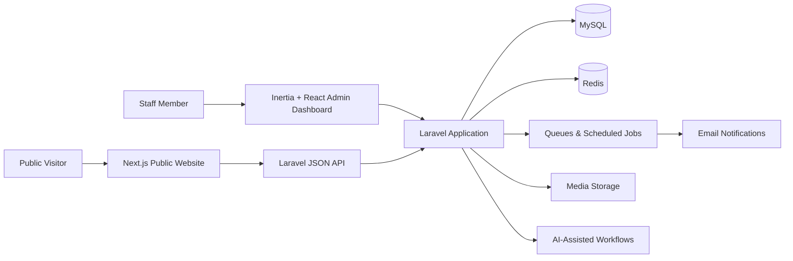
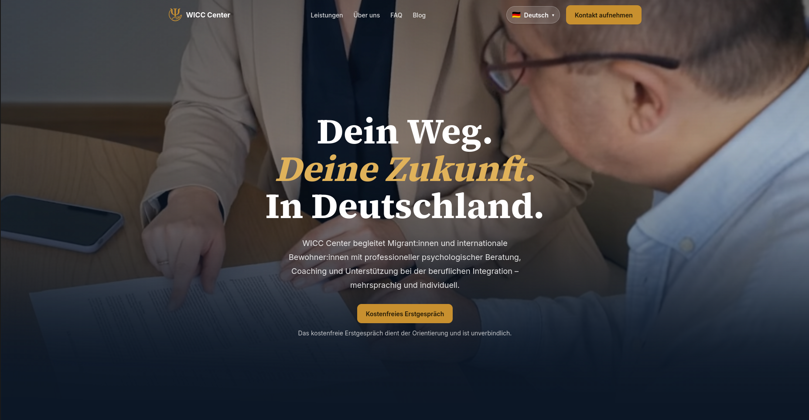
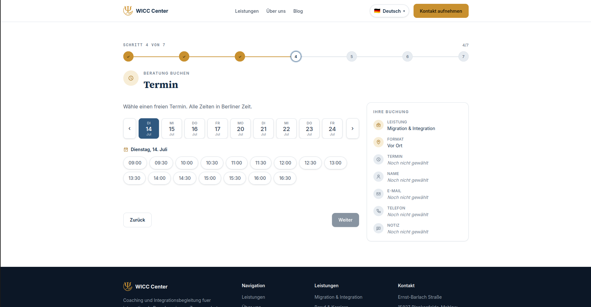
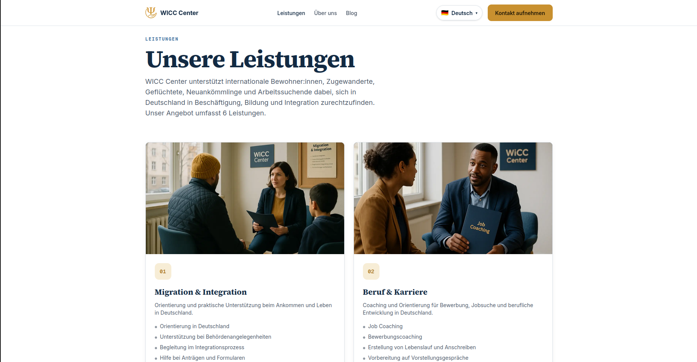
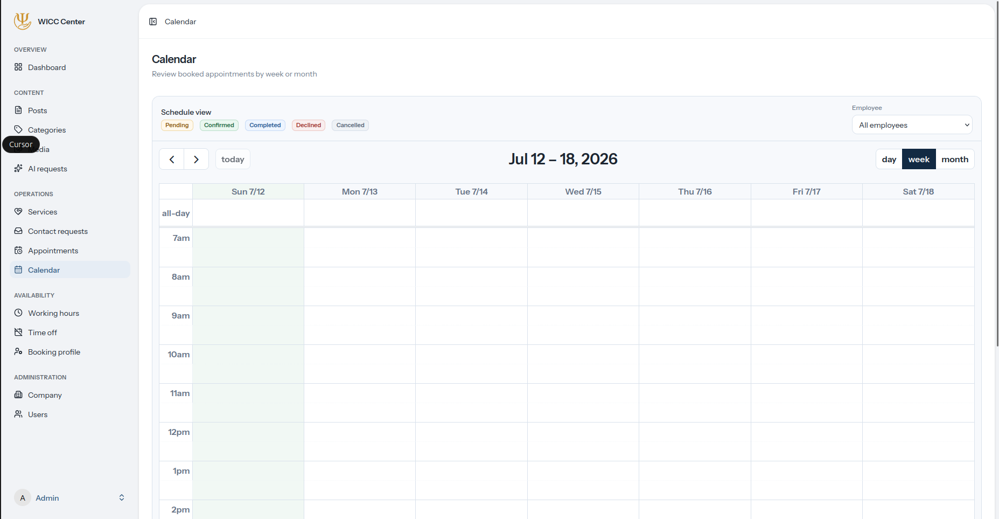
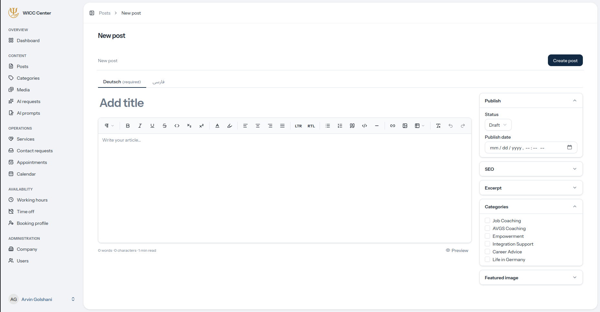

# 🌍 WICC Center | Multilingual Coaching, Content & Appointment Platform

> This is a portfolio repository introducing the project.  
> The production source code is maintained in a private repository.

[View Live Website](https://wicccenter.de/)

---

## 📖 Table of Contents

1. [About the Project](#about-the-project)
2. [The Challenge](#the-challenge)
3. [The Solution](#the-solution)
4. [Core Features](#core-features)
5. [System Architecture](#system-architecture)
6. [Product Areas](#product-areas)
7. [Tech Stack](#tech-stack)
8. [Engineering Highlights](#engineering-highlights)
9. [Screenshots](#screenshots)
10. [Project Status](#project-status)
11. [Future Development](#future-development)
12. [Developer](#developer)
13. [Repository Notice](#repository-notice)

---

## 📌 About the Project

**WICC Center** is a multilingual web and operations platform developed for a Berlin-based coaching and integration organization.

The organization supports international residents, immigrants, refugees, newcomers, and job seekers as they navigate employment, education, personal development, and integration in Germany.

The platform serves two connected audiences:

1. **Public visitors**, who need clear information, trustworthy guidance, and an accessible way to contact the organization or request an appointment.
2. **Internal staff**, who need a secure system for managing services, availability, appointments, contact requests, website content, media, translations, and organizational information.

The project combines a multilingual public website with a complete administration application and a structured JSON API.

---

## ❗ The Challenge

A coaching and integration organization needs more than a conventional company website.

Visitors may arrive with different:

- languages
- cultural backgrounds
- accessibility needs
- levels of familiarity with German systems
- service requirements
- communication preferences

At the same time, staff need to coordinate services, consultation requests, appointment availability, employee schedules, multilingual content, editorial publishing, media assets, permissions, and account security.

Managing these concerns through disconnected forms, calendars, documents, and website tools creates duplicated work and inconsistent information.

---

## ✅ The Solution

WICC Center brings the public experience and internal operations together through a separated but connected architecture.

The platform provides:

- a multilingual public website built with Next.js
- a guided contact and appointment intake experience
- availability-based guest appointment booking
- secure appointment cancellation and rescheduling
- a Laravel-powered JSON API
- a role-aware React and Inertia administration dashboard
- service, content, media, and company information management
- employee availability and appointment calendar management
- AI-assisted translation and editorial workflows
- queued email notifications and appointment reminders

The Laravel application remains the authoritative source for operational and content data, while the Next.js application delivers the optimized public experience.

---

## 🎯 Core Features

### Public Website

- **Multilingual experience:** Locale-aware public pages with left-to-right and right-to-left layout support
- **Localized routing:** Language-prefixed routes with canonical URL handling
- **Service discovery:** Backend-managed coaching and support services
- **Guided intake wizard:** One accessible flow for contact inquiries and appointment requests
- **Availability-based booking:** Visitors select a service, consultation format, date, and available time
- **Guest appointment management:** Secure token-based cancellation and rescheduling without requiring an account
- **Organization and founder profiles:** Backend-managed company and founder information
- **Editorial blog:** Localized listing and article pages with categories, SEO metadata, related content, and reading progress
- **Search-engine support:** Sitemap, robots policy, canonical URLs, localized alternates, metadata, and structured data
- **Responsive interface:** Purpose-built desktop, tablet, mobile, and RTL layouts
- **Accessible interaction:** Keyboard navigation, focus management, semantic controls, live-region feedback, and reduced-motion support

### Administration Platform

- **Role-aware dashboard:** Operational summaries based on the signed-in employee’s permissions
- **Service management:** Multilingual descriptions, appointment duration, buffers, ordering, visibility, and imagery
- **Appointment management:** Review appointments and control their lifecycle
- **Staff calendar:** Day, week, and month views with permission-aware employee filtering
- **Availability management:** Working hours, exceptions, offered services, and employee profiles
- **Contact request management:** Review and classify incoming inquiries
- **Content management:** Create and publish articles, categories, SEO fields, and cover media
- **Media library:** Upload, optimize, organize, reuse, and safely remove images
- **Company settings:** Manage public contact details, social links, legal information, founder profile, and timeline
- **User management:** Create staff accounts, assign roles, and block or unblock access
- **AI task monitoring:** Track asynchronous translation, writing-assistance, and image-generation tasks

### Security and Operations

- Role-based access control
- Server-side authorization policies
- Passkey authentication
- Two-factor authentication
- Verified staff accounts
- Rate-limited public API endpoints
- Server-side appointment validation
- Transaction and locking protection for booking conflicts
- HTML content sanitization
- Queued email notifications
- Scheduled appointment reminders
- Protected media deletion with usage checks

---

## 🧠 System Architecture

WICC Center uses a monorepo containing two independent applications with a clear API boundary.

### Public application

The **Next.js App Router application** owns the customer-facing experience: multilingual routing, server-rendered pages, incremental content revalidation, SEO, the contact and booking interface, guest appointment self-service, and responsive RTL presentation.

### Backend and administration application

The **Laravel application** owns business rules, data, authentication, authorization, content operations, appointments, availability, queues, and public API responses.

Its administration interface uses **Inertia.js and React**, retaining Laravel’s routing and authorization model while providing a modern client-side experience.

### Application boundary

Public content and booking information flow from Laravel to Next.js through a structured JSON API. This enables independent interfaces and deployments while keeping business rules and content ownership centralized.

---

## 🧩 Product Areas

### 1. Multilingual Public Experience

The public website presents WICC Center’s services, organization, founder story, contact process, and editorial content. Localization affects routes, navigation, metadata, typography, document direction, forms, validation feedback, and booking confirmation.

The public interface supports German, English, French, Persian, Kurdish language variants, Spanish, Ukrainian, and Arabic. Blog publishing is intentionally limited to German and Persian.

### 2. Guided Contact and Booking

The unified intake wizard lets visitors request an appointment or send a message. The booking path covers service selection, consultation format, available date and time, personal details, review, and confirmation.

### 3. Availability and Scheduling

Employees define regular working hours, availability exceptions, offered services, and profile information. Available slots are calculated by the backend and revalidated during submission to prevent stale or conflicting bookings.

### 4. Guest Appointment Self-Service

Using a secure management link, guests can view a safe appointment summary, cancel an appointment, browse updated availability, or reschedule without creating an account.

### 5. Operational Dashboard

The role-aware dashboard summarizes contact requests, upcoming appointments, published articles, active services, and staff activity. Employees only see information permitted by their role and appointment scope.

### 6. Content and Media Management

Staff manage articles, categories, localized content, publication state, SEO fields, cover images, and reusable media. The media library includes optimization, thumbnails, metadata editing, and usage-aware deletion protection.

### 7. Company and Founder Management

Staff maintain public contact details, social links, legal information, founder biography, quote, image, and timeline through the administration platform rather than duplicating this content in the frontend.

### 8. Roles and Permissions

The platform supports super administrator, administrator, employee, and content writer responsibilities. Authorization is enforced on the server, and the interface adapts to the current user’s permissions.

### 9. AI-Assisted Content Operations

Tracked background workflows assist with translations, article drafting, field improvement, article cover images, service imagery, and founder information without blocking dashboard navigation.

---

## 🛠 Tech Stack

### Public Frontend

- **Next.js 16**
- **React 19**
- **TypeScript 5**
- **App Router and Server Components**
- **Incremental Static Regeneration**
- **Tailwind CSS 4**
- **Motion**
- **Storybook**

### Backend

- **Laravel 13**
- **PHP 8**
- **Eloquent ORM**
- **Laravel Fortify**
- **Laravel AI**
- **JSON API resources**
- **Queues and scheduled commands**
- **Server-side policies and validation**

### Administration Frontend

- **React 19**
- **Inertia.js 3**
- **TypeScript**
- **Tailwind CSS 4**
- **Vite 8**
- **Radix UI primitives**
- **TipTap rich-text editor**
- **FullCalendar**
- **Wayfinder-generated route bindings**

### Data, Infrastructure, and Quality

- **MySQL**
- **Redis**
- **Docker and Laravel Sail**
- **Shared design-token package**
- **PHPUnit**
- **ESLint and Prettier**
- **Laravel Pint**
- **TypeScript static checking**
- **Storybook accessibility tooling**

---

## 🏗 Engineering Highlights

### API-driven application separation

Laravel owns authoritative service, company, founder, booking, and blog data and publishes structured responses for the Next.js public website.

### Safe appointment booking

Availability is recalculated and validated when an appointment is submitted. Database transactions and locking help prevent two visitors from claiming the same slot.

### Permission-aware operations

Laravel middleware, permissions, and policies enforce authorization. Employees can be scoped to their own availability and appointments while managers receive broader operational access.

### Multilingual and RTL architecture

Localization is architectural rather than cosmetic, affecting routing, metadata, typography, navigation, content selection, forms, and document direction.

### Background processing

Email delivery, reminders, translation, writing assistance, and image generation use queued or scheduled workflows.

### Cache revalidation

Backend content changes can trigger Next.js revalidation, keeping cached pages performant while allowing content updates without full redeployment.

### Shared design system

Shared design tokens improve consistency across the public website and administration interface without tightly coupling the applications.

---

## 📸 Screenshots

### Public Website

### Guided Appointment Booking

### Services

### Administration Dashboard

### Staff Calendar

### Content Management

> Replace these files with selected production screenshots while ensuring that no private client, staff, contact, or appointment information is visible.

---

## 🚧 Project Status

WICC Center is in active development, with the main product foundation implemented.

### Implemented

- multilingual public website with responsive RTL layouts
- service and company API integration
- contact inquiry and availability-based appointment booking
- secure guest appointment management
- staff availability and operational calendar
- contact request administration
- article, category, service, and media management
- company and founder management
- role-based access control
- passkeys and two-factor authentication
- queued email workflows and appointment reminders
- AI-assisted translation and content workflows
- sitemap, metadata, structured data, and SEO foundations

---

## 👨‍💻 Developer

**Arvin Golshani**  
Software Developer

- GitHub: [github.com/ArvinGolshani](https://github.com/ArvinGolshani)
- Live project: [wicccenter.de](https://wicccenter.de/)

---

## 🔒 Repository Notice

This repository is a public portfolio presentation of WICC Center. The production source code, infrastructure configuration, environment variables, internal documentation, and operational data are maintained privately.

This repository does not contain:

- production source code
- private business data
- client or appointment information
- staff account information
- credentials or environment configuration
- proprietary deployment configuration

---

## ⭐ Portfolio Note

WICC Center is a real-world full-stack project designed around the needs of a coaching and integration organization.

It combines a polished multilingual public experience, secure operational administration, structured content management, availability-based booking, role-aware staff workflows, API-driven application boundaries, background processing, and AI-assisted content operations.

The project reflects my ability to translate organizational requirements into a maintainable, secure, and production-oriented software platform.
